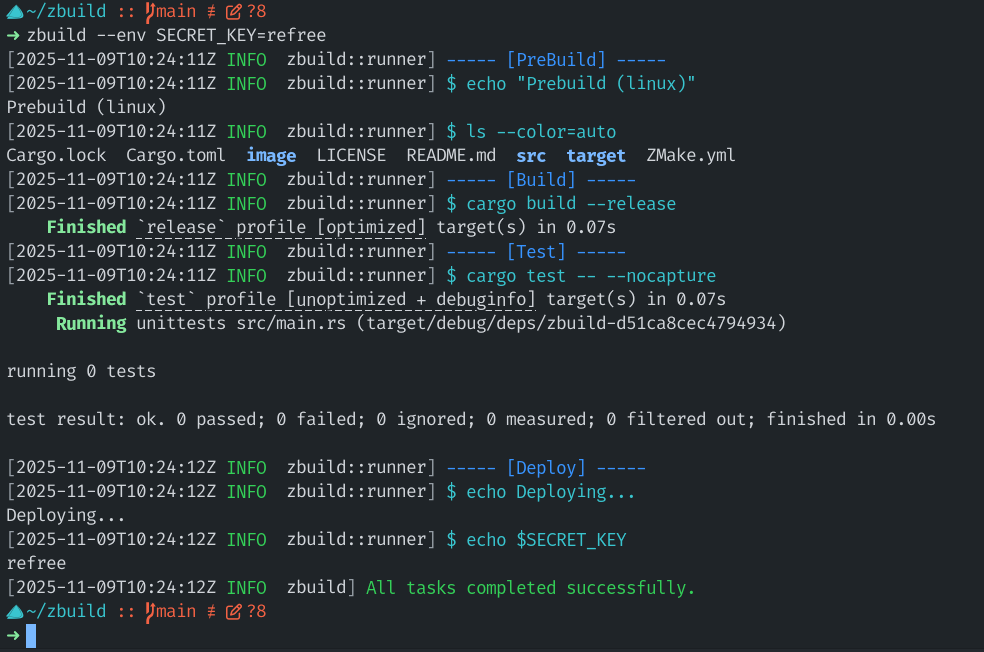
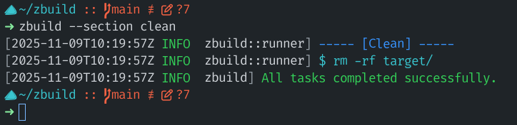

# ZBuild

A lightweight and extensible CI/CD tool based on YAML configuration.
This tool allows defining named task groups and running them with controlled environments, OS overrides, dry-run mode, and execution sections.

## Features

- Execute tasks defined in a `ZMake.yml` file.
- Optional OS override for cross-platform task configurations.
- Select specific sections of tasks to run.
- Support for extra environment variables and environment variable files.
- Dry-run mode to print commands without executing them.
- Configurable failure behavior (fail fast or continue on error).
- Verbosity control with `-v`, `-vv`, `-vvv`.

## Installation

Follow the following steps to build and install the latest version of the `zbuild` tool:

- Get the source code

```bash
  git clone https://github.com/LowLevelLore/zbuild
  cd zbuild
```

- Build the executable

```bash
  cargo build --release
```

- Install/Add to path ad cleanup (Optional)

```bash
  cp targets/release/zbuild /usr/bin/zbuild
  cd ..
  rm -rf zbuild
```

## Usage

This CI/CD tool can be used in the following ways for now:

```bash
zbuild [OPTIONS] [FILE]
```

### Arguments

| Argument | Description              | Default   |
| -------- | ------------------------ | --------- |
| FILE     | Path to YML config file. | ZMake.yml |

### Options

| Option                      | Description                                                                                                                 | Constraints                                                              |
| --------------------------- | --------------------------------------------------------------------------------------------------------------------------- | ------------------------------------------------------------------------ |
| --cwd `<DIR>`             | Working directory for execution. If omitted, uses current directory.                                                        | [Any valid directory path]                                               |
| --os `<OS>`               | Which os specific commands to run ? If the detected OS doesnt match the passed OS, dry run mode will be applied by default. | [windows, linux, macos]                                                  |
| --sections `<SECTION>`    | Run only the specified sections. Can be repeated. Clean will only be called when passed explicitly                          | [prebuild, build, postbuild, test, predeploy, deploy, postdeploy, clean] |
| --continue-on-error         | Continue executing remaining tasks if one fails.                                                                            | FLAG                                                                     |
| --dry-run                   | Print commands instead of executing them.                                                                                   | FLAG                                                                     |
| --env `<KEY>`=`<VALUE>` | Inject extra environment variables (repeatable).                                                                            | [Any valid key value pair, must be passed as a string without quotes]    |
| --env-file `<FILE>`       | Load environment variables from a file.                                                                                     | [Any valid file path, that has valid key value pairs]                    |
| `-v`, `-vv`, `-vvv`   | Increase logging verbosity.                                                                                                 | FLAGS                                                                    |

## Example

All the sections are optional, the sections present in the yml file will be ran automatically in the below mentioned relative order, meaning if postbuild is not present this tool will skip to test section after build section.

```yaml
prebuild: # Install build dependencies
	linux:
		- echo "Hello from linux"
		- echo "Some $SECRET"
	windows:
		- echo "Hello from Windows"
	macos:
		- echo "Hello from MACOS"
build: # Actual building
	linux:
	windows:
	macos:
postbuild: # Remove those dependencies
	linux:
	windows:
	macos:
test: # Testing
	linux:
	windows:
	macos:
predeploy: # Some Configurations
	linux:
	windows:
	macos:
deploy: # Actual deployment
	linux:
	windows:
	macos:
postdeploy: # Notifications/Alerts
	linux:
	windows:
	macos:
clean: # Will only be ran if explicitly passed
	linux: 
		- "rm -rf target/"
	windows:
	macos:
```


### Usage

```bash
zbuild ./ZMake.yml --env SECRET=refree
```

**Self hoisting:**



**Clean the build:**



## LICENSE

This project is licensed under the MIT License. Visit `LICENSE` file for more details.
