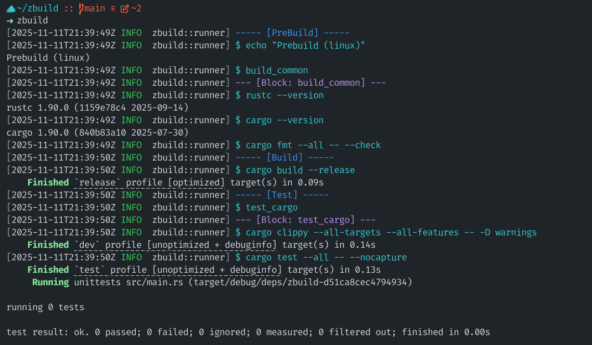

# ZBuild

A lightweight and extensible CI/CD tool based on YAML configuration.
This tool allows defining named task groups and running them with controlled environments, OS overrides, dry-run mode, and execution sections.

## Features

- Execute tasks defined in a `ZMake.yml` file.
- Optional OS override for cross-platform task configurations.
- Select specific sections of tasks to run.
- Support for extra environment variables and environment variable files.
- Dry-run mode to print commands without executing them.
- Configurable failure behavior (fail fast or continue on error).
- Verbosity control with `-v`, `-vv`, `-vvv`.

## Installation

Follow the following steps to build and install the latest version of the `zbuild` tool:

- Get the source code

```bash
  git clone https://github.com/LowLevelLore/zbuild
  cd zbuild
```

- Build the executable

```bash
  cargo build --release
```

- Install/Add to path ad cleanup (Optional)

```bash
  cp targets/release/zbuild /usr/bin/zbuild
  cd ..
  rm -rf zbuild
```

## Usage

This CI/CD tool can be used in the following ways for now:

```bash
zbuild [OPTIONS] [FILE]
```

### Arguments

| Argument | Description              | Default   |
| -------- | ------------------------ | --------- |
| FILE     | Path to YML config file. | ZMake.yml |

### Options

| Option                      | Description                                                                                                                 | Constraints                                                              |
| --------------------------- | --------------------------------------------------------------------------------------------------------------------------- | ------------------------------------------------------------------------ |
| --cwd `<DIR>`             | Working directory for execution. If omitted, uses current directory.                                                        | [Any valid directory path]                                               |
| --os `<OS>`               | Which os specific commands to run ? If the detected OS doesnt match the passed OS, dry run mode will be applied by default. | [windows, linux, macos]                                                  |
| --section `<SECTION>`     | Run only the specified sections. Can be repeated. Clean will only be called when passed explicitly                          | [prebuild, build, postbuild, test, predeploy, deploy, postdeploy, clean] |
| --continue-on-error         | Continue executing remaining tasks if one fails.                                                                            | FLAG                                                                     |
| --dry-run                   | Print commands instead of executing them.                                                                                   | FLAG                                                                     |
| --env `<KEY>`=`<VALUE>` | Inject extra environment variables (repeatable).                                                                            | [Any valid key value pair, must be passed as a string without quotes]    |
| --env-file `<FILE>`       | Load environment variables from a file.                                                                                     | [Any valid file path, that has valid key value pairs]                    |
| `-v`, `-vv`, `-vvv`   | Increase logging verbosity.                                                                                                 | FLAGS                                                                    |

## Documentation

All the sections are optional, the sections present in the yml file will be ran automatically in the below mentioned relative order, meaning if postbuild is not present this tool will skip to test section after build section.

```yaml
tasks:
	prebuild: # Any out of the following 8 predefined sections (relative order must be same)
		linux: # A block, a section can have a maximum of 3 predefind blocks (same name), also defining all 3 is recommended.
			steps: # Steps to run in this block
				- echo "Hello from Linux"
				- export DIR_NAME="build" # This environment variable will be available to all subsequent commands, it will have the greatest priority, will not be overwritten by local env variables
				- make_directory # This will call a block of code, mentioned in blocks given below.
				- echo "Some $KEY1"
			config: # configuration local to this block
				execution_policy: fast_fail # Can also be carry_forward
				env: # Defining local environment variables, override global and default variales
					KEY1: VALUE1
					KEY2: VALUE2

		windows:
			steps:
				- echo "Hello from Windows"
				- echo "Some $SECRET"
			config:
				execution_policy: fast_fail # Can also be carry_forward
				env:
					KEY1: VALUE1
					KEY2: VALUE2
		macos:
			steps:
				- echo "Hello from Windows"
				- echo "Some $SECRET"
			config:
				execution_policy: fast_fail # Can also be carry_forward
				env:
					KEY1: VALUE1
					KEY2: VALUE2
	# Other 7 sections may include the following, each section will have the corresponding 3 blocks
	build: 
	postbuild:
	test:
	predeploy:
	deploy:
	postdeploy:
	clean: # (Will only be ran if explicitly mentioned while running 'zbuild')

blocks:
	make_directory: # A reusable block of code, this can be invoked from the 8 predefined steps
		steps:
			- echo "Making Directory $DIR_NAME"
			- mkdir $DIR_NAME
		config:
			execution_policy: carry_forward

config: # Global configuration
	skip_sections: # Sections mentioned here will only be run if explicitly passed to the executable under --section <name>
		- predeploy
		- clean # No need to mention, by default it is skipped
	execution_policy: fast_fail # Applied to all the sections and all the block (if blocks dont override)
	envs: 
		KEY1: VALUE1
		KEY2: VALUE
```

## Example

The self hoisting part, where zbuild handles the own building and deployment (push to github) is mentioned below, which can be used as an extensive example for the documentation.

```yaml
tasks:
  prebuild:
    linux:
      steps:
        - echo "Prebuild (linux)"
        - build_common
    macos:
      steps:
        - echo "Prebuild (macos)"
        - build_common
    windows:
      steps:
        - echo Prebuild (windows)
        - build_common

  build:
    linux: &cargo_build
      steps:
        - cargo build --release
    macos:
      <<: *cargo_build
    windows:
      <<: *cargo_build

  test:
    linux: &test_steps
      steps:
        - test_cargo
    macos:
      <<: *test_steps
    windows:
      <<: *test_steps

  predeploy:
    linux:
      steps:
        - mkdir -p dist
        - test -f "target/release/${BIN}" || { echo "missing target/release/${BIN}. Did you run build?"; exit 1; }
        - cp "target/release/${BIN}" "dist/${BIN}"
        - echo "Packaged ${BIN} ${VERSION} -> dist/"
      config: &predeploy_config
        env:
          VERSION: "0.1.0"
    macos:
      steps:
        - mkdir -p dist
        - test -f "target/release/${BIN}" || { echo "missing "target/release/${BIN}". Run build first."; exit 1; }
        - cp "target/release/${BIN}" "dist/${BIN}"
        - (command -v strip >/dev/null 2>&1 && strip -x "dist/${BIN}") || true
        - echo "Packaged ${BIN} ${VERSION} -> dist/"
      config: 
        <<: *predeploy_config
    windows:
      steps:
        - powershell -Command "$ErrorActionPreference=Stop"
        - powershell -Command "New-Item -ItemType Directory -Force -Path dist | Out-Null"
        - powershell -Command "$env:BIN = zbuild"
        - powershell -Command "$src = \"target\\release\\$env:BIN.exe\""
        - powershell -Command "if (!(Test-Path $src)) { throw \"missing $src. Run build first.\" }"
        - powershell -Command "Copy-Item $src dist\\"
        - powershell -Command "Write-Output \"Packaged $env:BIN -> dist\\\""

  deploy:
    linux: &deploy_sh
      steps:
        - echo "Deploying…"
        - ls -lah .
        - git add . || true
        - if git diff-index --quiet HEAD --; then echo "No changes to deploy. Skipping commit and push."; exit 0; fi
        - git commit -m "${COMMIT_MESSAGE:-Automated deployment commit}"
        - echo "Pushing to origin main…"
        - git push origin main
        - echo "Deploy complete."
    macos:
      <<: *deploy_sh
    windows:
      steps:
        - powershell -Command "Write-Host Deploying…"
        - powershell -Command "Get-ChildItem -Force ."
        - powershell -Command "git add . 2>$null"
        - powershell -Command "$diff = git diff-index --quiet HEAD --; if ($LASTEXITCODE -eq 0) { Write-Host No changes to deploy. Skipping commit and push.; exit 0 }"
        - powershell -Command "git commit -m \"$(if ($env:COMMIT_MESSAGE) { $env:COMMIT_MESSAGE } else { Automated deployment commit })\""
        - powershell -Command "Write-Host Pushing to origin main…"
        - powershell -Command "git push origin main"
        - powershell -Command "Write-Host Deploy complete."

  clean:
    linux: &clean_sh
      steps:
        - rm -rf target/ dist/
        - echo "Cleaned."
    macos:
      <<: *clean_sh
    windows:
      steps:
        - rmdir /S /Q target 2>nul & rmdir /S /Q dist 2>nul & echo Cleaned.

blocks:
  build_common:
    steps:
      - rustc --version
      - cargo --version
      - cargo fmt --all -- --check
  test_cargo:
    steps:
      - cargo clippy --all-targets --all-features -- -D warnings
      - cargo test --all -- --nocapture

config:
  skip_sections:
    - predeploy
    - deploy
    - clean
  execution_policy: fast_fail
  env:
    BIN: zbuild

```

### Usage

```bash
zbuild ./ZMake.yml --env SECRET=refree
```

**Self hoisting:**



**Make Artifacts and push to github:**


**Clean the build:**


## LICENSE

This project is licensed under the MIT License. Visit `LICENSE` file for more details.
